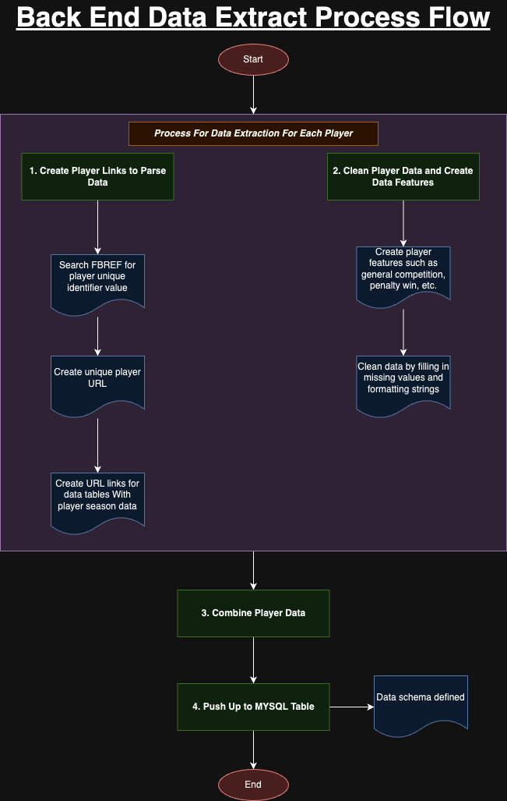

# Messi vs Ronaldo: Back End Data Extraction
## By: Carlos Monsivais

### Summary
Extracting data for Lionel Messi and Cristiano Ronaldo from [FBREF](https://fbref.com/en/) which is a website that tracks player match data and saves the values in tables. By requesting the data on these tables through CSS parsing we can create features and values that will be used in the web application to compare the two players by putting the data in a MYSQL table.

### Steps to Run
1. Create a virtual environment with the following command: `python3.10 -m venv env_name`
2. Activate the virtual environment with the following command: `source env_name/bin/activate`
3. Install the dependencies needed with the following command: `pip install -r requirements.txt`
4. Create a .env file in the location back_end/.env with the following variables:
```
###### MYSQL Database Login Information ######
MYSQL_USERNAME="db_username"
MYSQL_PASSWORD="db_password"
MYSQL_HOST="db_host"
MYSQL_PORT="db_port"
MYSQL_DB_NAME="db_name_var"
MYSQL_TABLE_NAME="output_table_name"

###### FBREF Player Names ######
PLAYER_1="Cristiano Ronaldo"
PLAYER_2="Lionel Messi"
```
5. Execute the main file with the following command: python3 main.py

### Execution Process


### Output Table Data Schema